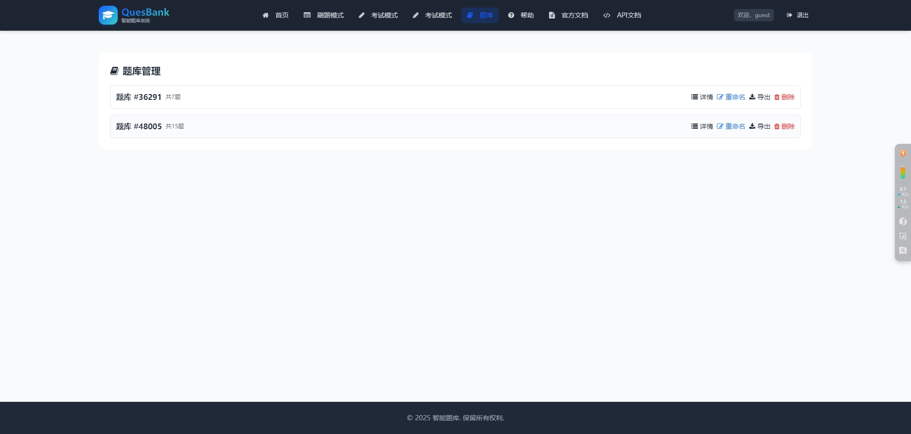

<!-- 项目LOGO -->
<p align="left">
  
  <span style="font-size:2rem; font-weight:bold; color:#2196f3; vertical-align:middle;">QuesBank</span>
  <span style="font-size:1rem; color:#888; vertical-align:middle; margin-left:8px;">智能题库系统</span>
</p>

<!-- 项目徽章 -->
<p align="left">
  
  
  
  
  
</p>

# QuesBank 智能题库网页版

**版本号：1.3.0**  
**更新日期：2025年6月30日**  
开发者：史智阳  
邮箱：562052228@qq.com

## 在线体验

🌐 **在线地址**: [https://weeexiao.github.io/QuesBank/](https://weeexiao.github.io/QuesBank/)

## 项目简介

QuesBank 智能题库网页版是一个面向教师和学生的本地化题库管理与刷题、考试平台。支持题库的导入导出、AI 生成题目、题库管理、刷题模式、考试模式等多种功能，界面美观，交互友好。

## 主要功能
- 支持手动输入、AI 生成、导入导出题库
- 题库本地管理（重命名、删除、导出、导入、新建）
- 刷题模式：自由刷题、查看解析、保存到题库
- 考试模式：多题库随机抽题、倒计时、自动评分、错题解析
- 题库详情：题目增删改查，支持多题型
- 支持批量导入、导出题库
- 响应式设计，适配PC和移动端
- **新增**: 用户注册登录系统
- **新增**: 数据库存储支持
- **新增**: 管理员用户管理功能
- **新增**: 一键部署向导
- **新增**: 宝塔面板部署支持
- **新增**: 快速部署脚本

## 主要页面
- `index.html`：主页，展示系统功能和快速入口
- `practice.html`：刷题模式主页面，支持AI生成、手动输入、题库收藏
- `exam.html`：考试模式页面，支持多题库抽题、倒计时、自动评分
- `bank.html`：题库管理页面，支持题库的增删改查、导入导出、新建
- `bank_detail.html`：题库详情页，支持题目增删改查
- `login.html`：用户登录注册页面
- `admin.html`：管理员用户管理页面
- `deploy.html`：一键部署向导页面
- `settings.html`：设置页面，预留通用设置项

## 快速开始

### 🚀 一键部署（推荐）

#### 方法一：宝塔面板快速部署（最简单）
1. **上传项目文件**
   - 将项目文件上传到 `/www/wwwroot/你的域名/`

2. **运行快速部署脚本**
   ```bash
   chmod +x 宝塔快速部署.sh
   sudo ./宝塔快速部署.sh
   ```

3. **按提示操作**
   - 输入您的域名
   - 脚本会自动安装依赖、配置Nginx、创建启动脚本

4. **启动服务**
   ```bash
   ./start.sh
   ```

5. **完成配置**
   - 访问：`http://你的域名.com/deploy`
   - 按照部署向导完成数据库配置

#### 方法二：使用部署向导
1. **启动服务器**
   ```bash
   cd server
   node app.js
   ```

2. **访问部署向导**
   - 打开浏览器访问：`http://localhost:3001/deploy`
   - 按照向导步骤完成配置

3. **完成部署**
   - 系统会自动生成配置文件
   - 初始化数据库和管理员账号
   - 创建启动脚本

#### 方法三：传统宝塔面板部署
1. **运行一键部署脚本**
   ```bash
   chmod +x 宝塔一键部署.sh
   sudo ./宝塔一键部署.sh
   ```

2. **上传项目文件**
   - 将项目文件上传到 `/www/wwwroot/quesbank`
   - 运行启动脚本：`/www/wwwroot/quesbank/start.sh`

3. **访问部署向导**
   - 访问：`http://你的域名.com/deploy`
   - 完成系统配置

详细部署指南请参考：[宝塔面板部署指南.md](宝塔面板部署指南.md)

### 本地测试

1. **环境准备**
   ```bash
   # 确保已安装 Node.js (v16+) 和 MySQL (v8+)
   node --version
   mysql --version
   ```

2. **一键启动**
   ```bash
   # Windows用户直接双击运行
   本地测试启动器.bat
   
   # 或手动启动
   cd server
   node app.js
   ```

3. **访问应用**
   - 后端API: http://localhost:3001
   - 前端页面: 直接在浏览器中打开HTML文件

### 详细测试步骤

1. **数据库配置**
   ```sql
   -- 创建数据库
   CREATE DATABASE quesbank CHARACTER SET utf8mb4 COLLATE utf8mb4_unicode_ci;
   
   -- 导入数据库结构
   mysql -u root -p quesbank < database_schema.sql
   ```

2. **环境变量配置**
   ```env
   # 在 server/config.env 中配置
   DB_HOST=localhost
   DB_PORT=3306
   DB_USER=root
   DB_PASSWORD=your_password
   DB_NAME=quesbank
   JWT_SECRET=your_jwt_secret_key_here
   ```

3. **测试验证**
   ```bash
   # 测试数据库连接
   cd server
   node test-db.js
   
   # 测试API接口
   node test-api.js
   ```

详细测试指南请参考：[本地测试指南.md](本地测试指南.md)

## 使用说明

### 用户功能
1. **注册登录**: 访问 `login.html` 注册新用户或登录
2. **刷题模式**: 访问 `practice.html` 进行刷题练习
3. **题库管理**: 访问 `bank.html` 管理个人题库
4. **考试模式**: 访问 `exam.html` 进行模拟考试
5. **设置**: 访问 `settings.html` 进行个性化设置

### 管理员功能
- 访问 `admin.html` 管理所有用户账号
- 查看用户统计信息
- 导出用户数据
- 删除违规用户

### 默认管理员账号
- 用户名: `admin`
- 密码: `admin123`

## 反馈与支持
如有建议或问题，请联系开发者：史智阳  
邮箱：562052228@qq.com

## 技术特性

### 前端技术
- HTML5 + CSS3 + JavaScript
- Tailwind CSS 样式框架
- Font Awesome 图标库
- 响应式设计

### 后端技术
- Node.js + Express
- MySQL 数据库
- JWT 身份认证
- bcrypt 密码加密

### API集成
- DeepSeek Chat API
- 异步请求处理
- 错误处理和重试机制
- 用户友好的提示信息

### 数据格式
```json
{
  "选择题": [
    {
      "question": "题目内容",
      "options": ["选项A", "选项B", "选项C", "选项D"],
      "answer": "正确答案",
      "explanation": "解析说明"
    }
  ],
  "填空题": [
    {
      "question": "题目内容，用(  )表示空位",
      "answer": "正确答案",
      "explanation": "解析说明"
    }
  ],
  "判断题": [
    {
      "question": "题目内容",
      "answer": "正确/错误",
      "explanation": "解析说明"
    }
  ]
}
```

## 配置说明

### API配置
默认API Key已配置，如需使用自己的Key：
1. 在"API Key"输入框中输入您的DeepSeek API Key
2. 点击眼睛图标可切换显示/隐藏

### 数据库配置
详细配置说明请参考：[数据库部署说明.md](数据库部署说明.md)

## 浏览器兼容性
- Chrome 60+
- Firefox 55+
- Safari 12+
- Edge 79+

## 注意事项
1. 请确保网络连接正常以使用AI生成功能
2. 建议定期导出题库作为备份
3. 清空题库操作不可恢复，请谨慎操作
4. API调用可能产生费用，请注意使用频率
5. 本地测试需要MySQL数据库支持

## 更新日志

### v1.3.0 (2025-06-30) - 导航栏优化更新
- 🎨 **全面优化导航栏系统**：实现统一、现代化、响应式设计
- ✨ **新增毛玻璃效果**：使用backdrop-filter实现现代感视觉效果
- 🌈 **渐变色彩设计**：采用蓝色渐变主题，符合教育类应用风格
- 📱 **完善移动端适配**：支持触摸友好的汉堡菜单和网格布局
- 🔧 **统一页面导航**：为所有9个页面添加统一导航栏
- 🛠️ **修复遮挡问题**：为所有页面主内容区域添加顶部边距
- 🎯 **优化用户体验**：改进用户状态管理和权限控制
- 🎨 **重构测试页面**：test.html采用现代化设计风格
- 📦 **组件化架构**：创建可复用的导航栏组件
- ⚡ **性能优化**：高效的CSS和JavaScript实现

### v1.2.1 (2025-06-28)
- 新增宝塔面板快速部署脚本
- 优化部署流程，支持一键配置Nginx
- 新增PM2进程管理配置
- 新增启动、停止、重启脚本
- 完善部署文档和说明
- 优化错误处理和用户提示

### v1.2.0 (2025-01-XX)
- 新增用户注册登录系统
- 新增数据库存储支持
- 新增管理员用户管理功能
- 新增JWT身份认证
- 新增API接口文档
- 新增一键部署向导
- 新增宝塔面板部署支持
- 优化前端界面和交互
- 新增本地测试支持

### v1.1.0 (2025-01-XX)
- 新增题库管理功能
- 新增考试模式
- 新增导入导出功能
- 优化AI生成算法
- 改进用户界面

### v1.0.0 (2025-01-XX)
- 初始版本发布
- 支持基础题目解析和答题功能
- 集成DeepSeek API
- 实现本地题库管理
- 添加导入导出功能

## 部署教程

### 🚀 一键部署（推荐）

#### 宝塔面板快速部署
1. 上传项目文件到 `/www/wwwroot/你的域名/`
2. 运行 `宝塔快速部署.sh` 脚本
3. 按提示输入域名
4. 运行 `./start.sh` 启动服务
5. 访问 `http://你的域名.com/deploy` 完成配置

#### 部署向导
1. 启动Node.js服务
2. 访问 `http://localhost:3001/deploy`
3. 按照向导完成配置

#### 传统宝塔面板部署
1. 运行 `宝塔一键部署.sh` 脚本
2. 上传项目文件
3. 运行启动脚本
4. 访问部署向导完成配置

详细部署说明请参考：[宝塔面板部署指南.md](宝塔面板部署指南.md)

### 本地开发部署

1. **克隆项目**
   ```bash
   git clone https://github.com/Weeexiao/QuesBank.git
   cd QuesBank
   ```

2. **配置数据库**
   ```bash
   # 创建数据库
   mysql -u root -p -e "CREATE DATABASE quesbank;"
   
   # 导入数据库结构
   mysql -u root -p quesbank < database_schema.sql
   ```

3. **配置环境变量**
   ```bash
   # 复制配置文件
   cp server/config.env.example server/config.env
   
   # 编辑配置文件
   nano server/config.env
   ```

4. **启动服务**
   ```bash
   # 安装依赖
   cd server
   npm install
   
   # 启动服务器
   node app.js
   ```

### 生产环境部署

详细部署说明请参考：[数据库部署说明.md](数据库部署说明.md)

### GitHub Pages 部署（静态版本）

1. **Fork 项目**
   ```bash
   # 点击右上角 Fork 按钮，将项目复制到你的 GitHub 账户
   ```

2. **启用 GitHub Pages**
   - 进入你的仓库设置 (Settings)
   - 找到 Pages 选项
   - Source 选择 "Deploy from a branch"
   - Branch 选择 "main" 或 "master"
   - 保存设置

3. **访问你的网站**
   ```
   https://你的用户名.github.io/QuesBank/
   ```

## 开发指南

### 项目结构
```
QuesBank-master/
  ├── admin.html                # 管理后台页面
  ├── api.html                  # API接口测试页面
  ├── API接口文档.md            # API接口说明文档
  ├── bank_detail.html          # 题库详情页面
  ├── bank_detail.js            # 题库详情页面JS逻辑
  ├── bank.html                 # 题库管理主页面
  ├── bank.js                   # 题库管理页面JS逻辑
  ├── database_schema.sql       # 数据库结构SQL
  ├── demo.html                 # 功能演示页面
  ├── deploy.html               # 部署向导页面
  ├── exam.html                 # 考试模式页面
  ├── exam.js                   # 考试模式页面JS逻辑
  ├── fonts/                    # 字体文件目录
  │   ├── README.md             # 字体说明
  │   └── SimHei.ttf            # 黑体字体文件
  ├── help.html                 # 帮助页面
  ├── image/                    # 图片资源目录
  │   ├── bank.png              # 题库页面示意图
  │   ├── exam.png              # 考试页面示意图
  │   ├── index.png             # 首页示意图
  ├── index.html                # 首页主页面
  ├── js/                       # 前端JS及样式目录
  │   ├── api.js                # API相关JS
  │   ├── navbar.css            # 导航栏样式
  │   └── navbar.js             # 导航栏JS逻辑
  ├── login.html                # 登录页面
  ├── package-lock.json         # npm依赖锁定文件
  ├── package.json              # npm依赖配置
  ├── PDF导出服务使用说明.md    # PDF导出服务说明
  ├── practice.html             # 刷题模式页面
  ├── QuesBank启动器.bat        # Windows启动器
  ├── readme.html               # 图文说明页面
  ├── README.md                 # 项目说明文档
  ├── server.js                 # Node.js后端主服务
  ├── settings.html             # 设置页面
  ├── test_export.html          # 试卷导出测试页面
  ├── test.html                 # 功能测试页面
  ├── update_navigation.py      # 导航栏批量更新脚本
  ├── 启动QuesBank.bat          # Windows一键启动脚本
  ├── 启动器使用说明.md          # 启动器使用说明
  ├── 图标修复说明.md            # 图标显示问题说明
  ├── 宝塔一键部署.sh            # 宝塔面板一键部署脚本
  ├── 宝塔快速部署.sh            # 宝塔面板快速部署脚本
  ├── 宝塔面板部署指南.md        # 宝塔面板部署详细指南
  ├── 导航栏优化说明.md          # 导航栏优化说明
  ├── 导航栏拥挤问题解决方案.md  # 导航栏拥挤问题说明
  ├── 导航栏更新总结.md          # 导航栏更新总结
  ├── 导航栏统一更新总结.md      # 导航栏统一更新说明
  ├── 快速启动.bat               # Windows快速启动脚本
  ├── 数据库部署说明.md          # 数据库部署说明
  ├── 文本框空格问题修复说明.md  # 文本框空格修复说明
  ├── 更新日志.md                # 更新日志
  ├── 本地测试启动器.bat          # 本地测试专用启动脚本
  ├── 本地测试指南.md            # 本地测试说明
  ├── 首页图片展示优化说明.md    # 首页图片展示优化说明
```

### API接口文档

#### 认证接口
- `POST /api/auth/register` - 用户注册
- `POST /api/auth/login` - 用户登录
- `GET /api/auth/profile` - 获取用户信息

#### 题库接口
- `GET /api/banks` - 获取题库列表
- `POST /api/banks` - 创建题库
- `PUT /api/banks/:id` - 更新题库
- `DELETE /api/banks/:id` - 删除题库

#### 题目接口
- `GET /api/questions` - 获取题目列表
- `POST /api/questions` - 添加题目
- `PUT /api/questions/:id` - 更新题目
- `DELETE /api/questions/:id` - 删除题目

#### 考试接口
- `POST /api/exams/start` - 开始考试
- `POST /api/exams/answer` - 提交答案
- `POST /api/exams/:id/finish` - 完成考试
- `GET /api/exams/records` - 获取考试记录

#### 部署接口
- `GET /api/deploy/status` - 检查部署状态
- `POST /api/deploy/test` - 测试数据库连接
- `POST /api/deploy/install` - 执行安装

详细API文档请参考：[API接口文档.md](API接口文档.md)

## 贡献指南

欢迎提交Issue和Pull Request来改进项目！

1. Fork 项目
2. 创建功能分支 (`git checkout -b feature/AmazingFeature`)
3. 提交更改 (`git commit -m 'Add some AmazingFeature'`)
4. 推送到分支 (`git push origin feature/AmazingFeature`)
5. 打开 Pull Request

## 许可证

本项目采用 MIT 许可证 - 查看 [LICENSE](LICENSE) 文件了解详情。

---

**注意**: 本项目仅供学习和研究使用，请遵守相关法律法规和API使用条款。

## V1.4 (2025-07-01)
- 首页新增 QuesBank 品牌动画，支持渐变描边、发光、两行标题、主副标题分层动画，副标题支持由远及近动画和静态描边。
- 打赏弹窗全面升级，支持本地二维码、SVG单选、渐变美化、移动端适配。
- 新增题库导出标准A4试卷（HTML/WPS/Word）功能，排版美观，支持题型分组、自动编号、答题区等。
- 首页动画和打赏弹窗均支持现代浏览器，视觉体验大幅提升。
- 细节优化：副标题动画、发光、描边、渐隐时序等。

## 打赏支持

如果本项目对你有帮助，欢迎扫码支持开发者持续优化：

<div align="center">
  
  
</div>

感谢您的支持！ 